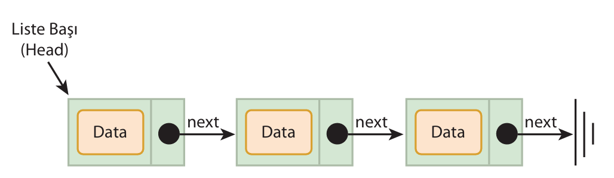

# Arrays 

An array is a data structure that stores data of the same type under a single variable. The length of an array has a fixed value and is determined when the array is created. Each piece of data in an array is called an element. The index starts at 0 and increases sequentially up to one less than the array's length.


Arrays can be one-dimensional or multidimensional.

array-type array-name [array-length];

int integerArray[10]; char characterArray[20];

Assigning Values to Arrays
When an array is defined by specifying its data type, name, and capacity, the computer allocates memory space for the array; however, no values are assigned to the array elements.

```

#include <stdio.h>
#include <conio.h>

int main(void)
{
    int dizi[6];

    int i;

    for (i = 0; i < 6; i++)
    {
        dizi[i] = 0;
        printf("dizi[%d] = %d\n", i, dizi[i]);
    }
    
    getch();
    return 0;
}

```

```

#include <stdio.h>
#include <conio.h>

#define N 5 

int main(void)
{
    int dizi1[N] = {1, 2, 3, 4, 5};
    int dizi2[N] = {1, 2};

    int i;

    for (i = 0; i < N; i++)
    {
        printf("dizi1[%d] = %d\t", i, dizi1[i]);
        printf("dizi2[%d] = %d\n", i, dizi2[i]);
    }
    
    getch();
    return 0;
}

```

# Çok Boyutlu Diziler

## İki Boyutlu Diziler

Two-dimensional arrays are the simplest form of multidimensional arrays. They can be defined as tables consisting of rows and columns. A two-dimensional array with m rows and n columns can contain up to m × n elements.


When assigning values to two-dimensional arrays, both dimensions must be iterated over. One way to meet this requirement is to set up two nested for loops.

```

#include <stdio.h>
#include <conio.h>

#define M 4
#define N 3

int main(void)
{
    int dizi[M][N] = { {1, 2, 3}, {4, 5, 6}, {7}, {8, 9, 10} };

    int i, j;

    for (i = 0; i < M; i++)
    {
        for (j = 0; j < N; j++)
        {
            printf("dizi[%d][%d] = %d\n", i, j, dizi[i][j]);
        }
        
    }
    
    
    getch();
    return 0;
}

```

## Three-Dimensional Arrays

Three-dimensional arrays are formed by stacking two-dimensional arrays. "Array of two-dimensional arrays." The total number of elements in a three-dimensional array with dimensions a, b, and c is a × b × c.

The array definition and element value assignment operations in three-dimensional arrays are similar to those in two-dimensional arrays. Three nested for loops can be used when traversing the elements of three-dimensional arrays.


```

#include <stdio.h>
#include <conio.h>

int main(void)
{
    int d[3][2][2] = {12, 11, 10, 9, 8, 7, 6, 5, 4, 3, 2, 1};

    int i, j, k;

    for (i = 0; i < 3; i++)
    {
        for (j = 0; j < 2; j++)
        {
            for (k = 0; k < 2; k++)
            {
                printf("%d\n", d[i][j][k]);
            }
            
        }
        
    }
    
    
    
    getch();
    return 0;
}

```

## Linked Lists

A linked list is a data structure that stores objects of the same type in a linear sequence. Each object is linked to the next one. These objects are called nodes, and they are linked to each other via next pointers that point to the next node. Linked lists also have a head pointer that points to the beginning of the list.

Nodes in linked lists usually consist of two parts. The first part stores the data, and the second part stores the location of the next node in computer memory.




## Comparing Linked Lists and Arrays


- Data Structure Length: The length of an array is fixed, so the array length cannot be increased or decreased as needed. In contrast, the length of a linked list is dynamic, allowing new objects to be added and existing ones to be deleted.

- Memory usage: In linked lists, memory must be allocated for each object's pointer. This is not the case with arrays.

- Cost of data insertion/deletion: Insertion and deletion operations in arrays are costly in terms of programming. In contrast, inserting or deleting in linked lists is less costly and easier.

- Direct Access to Data: Array elements can be accessed directly via indices. This is not the case with linked lists. To access an element of a linked list, the element must first be located in the list.

## Types of Linked Lists

When traversing the elements of a linked list, it is possible to move forward or backward and to access the beginning of the list from the end. These movement capabilities give rise to various types of linked lists.

- Singly Linked List
- Doubly Linked List
- Circular Linked List

## Unidirectional Linked List

Navigation between list nodes only occurs forward.


## Double-Linked List

You can navigate between list nodes in both directions. Each node in a doubly linked list contains two pointers: a next pointer and a previous pointer.


## Circular Linked List

A linked list becomes circular when the next pointer of the last node points to the first node. This type of list is called a circular linked list.

Both singly and doubly linked lists can be made circular.


Basic Operations on Linked Lists:

- Adding a New Element to the List
- Removing an element from the list
- Finding the total number of elements in the list
- Iterating through the elements of the list
- Searching for an element in the list
- Finding the first or last element of the list.

## Creating the Node Structure

- Data
- Next Pointer

```

struct Node {
    int data;
    struct Node* next;
};

struct Node* head = NULL;

```

## Adding an Element to the List (Insertion)

During the insertion process, the malloc function allocates memory for the node to be inserted. Now, let's insert at the beginning of the list.


```

void insert(int a)
{
    struct Node *t = (struct Node *)malloc(sizeof(struct Node));

    t->data = a;

    t->next = head;
    head = t;
}

```

## Removing an Item from the List (Deletion)

A node is deleted from memory using the free function when it is removed. If the removal is to be performed from an intermediate section of the list, first locate the node within the list and then perform the removal operation. The function that performs removal from the front of linked lists is:

```

void delete()
{
    if(head != NULL)
    {
        struct Node *t = head;

        head = head->next;
        free(t);
    }
}

```

## List Navigation (Traversal)

Traversing a linked list means going from the beginning to the end of the list. This process continues until the last element is reached—that is, until an element is found whose next pointer is null. While traversing the list, one can also perform operations such as searching for elements or printing them to the screen.

```

#include <stdio.h>
#include <conio.h>
#include <stdlib.h>

struct Node {
    int data;
    struct Node* next;
};

struct Node* head = NULL;

void insertToHead(int a)
{
    struct Node *t = (struct Node *)malloc(sizeof(struct Node));

    t->data = a;
    t->next = head;
    head = t;
}

void deleteFromHead()
{
    if(head != NULL)
    {
        struct Node *t = head;
        head = head->next;
        free(t);
    }
}

void printList()
{
    struct Node* t = head;

    while(t != NULL)
    {
        printf("%d -> ", t->data);
        t = t->next;
    }
}

int main()
{
    int i, j;

    for (i = 1; i < 10; i++)
    {
        insertToHead(i);
    }

    printList();
    printf("\n");

    for (j = 0; j < 4; j++)
    {
        deleteFromHead();
    }
    
    printList();
    getch();
    
}

```

## Queues

The concept of a queue is present in both everyday life and programming. In programming, a queue is a data structure that stores data in a linear sequence. A queue has a front and a rear. The basic operations of a queue are enqueue (adding) at the rear and dequeue (removing) at the front. Therefore, the first element to enter the queue is the first element to leave the queue (FIFO). (FIFO)

FIFO stands for first-in, first-out. In programming, queues are referred to by the FIFO rule. This expression translates to "first in, first out."


- Queue programming using arrays
- Queue programming using linked lists

## Queue Application with Arrays

This method requires an array to store the data, an integer to track the front of the queue, an integer to track the end of the queue, and an integer to indicate the number of elements currently in the queue. Assuming the queue data structure will store integer-type values:

- int queue[N]: An integer array of length N that will hold the elements in the queue
- int front: The index pointing to the front of the queue
- int rear: The index pointing to the rear of the queue
- int count: The number of elements in the queue

```

#include <stdio.h>

#define     N   6

int queue[N];
int front = 0, rear = 0, count = 0;

void enqueue(int new)
{
    if(count == N)
    {
        printf("Kuyrukta yer yoktur!\n");
    }
    else
    {
        queue[rear] = new;
        rear++;
        if(rear == N)
        {
            rear = 0;
        }
        count++;
        printf("%d kuyruga eklendi.\n", new);
    }
}

void dequeue() 
{
    if(count == 0)
    {
        printf("Kuyrukta eleman yoktur.\n");
    }
    else
    {
        int removed = queue[front];
        front++;
        if(front == N)
        {
            front = 0;
        }
        count--;
        printf("%d kuyruktan cikarildi\n", removed);
    }
}

void printQueue(int queue[])
{
    printf("Queue: ");
    int idx = front;

    for (int i = 0; i < count; i++)
    {
        printf("%d ", queue[idx]);
        idx = (idx + 1) % N;
    }
    printf("\n");
}

int main(void)
{
    printQueue(queue);
    printf("\n---------------\n");

    enqueue(10);
    enqueue(20);
    enqueue(30);
    enqueue(40);
    enqueue(50);
    enqueue(60);

    printQueue(queue);
    printf("\n---------------\n");

    dequeue();
    printf("\n---------------\n");
    printQueue(queue);

    return 0;
}

```

## Queue Application with Linked List

This method requires a data structure to create the elements of the linked list and pointers to track the head and tail of the queue.


- struct Node: Data structure for elements that will form the linked list
- struct Node* front: Node pointer representing the head of the queue
- struct Node* rear: Node pointer representing the tail of the queue

```

#include <stdio.h>
#include <stdlib.h>

struct Node
{
    int data;
    struct Node* next;
};

struct Node* front = NULL;
struct Node* rear = NULL;

void enqueue(int new)
{
    struct Node* newNode = (struct Node*) malloc(sizeof(struct Node));

    newNode->data = new;
    newNode->next = NULL;

    if(front == NULL && rear == NULL)
    {
        front = rear = newNode;
    }
    else
    {
        rear->next = newNode;
        rear = newNode;
    }

    printf("%d Kuyruga eklendi\n", new);
}

void dequeue()
{
    if(front == NULL)
    {
        printf("Kuyrukta eleman yoktur!\n");
    }
    else
    {
        struct Node* oldNode = front;
        
        if(front == rear)
        {
            front = rear = NULL;
        }
        else
        {
            front = front->next;
        }
        printf("%d kuyruktan cikarildi\n", oldNode->data);
        free(oldNode);
    }
}

```

## Example: Queue Array

```

#include <stdio.h>
#define N   5

int queue[N];
int front = 0, rear = 0, count = 0;

void enqueue(int newNum)
{
    if(count == N)
    {
        printf("Kuyruk Dolu! Yeni musteri alinamaz!\n");
    }
    else
    {
        queue[rear] = newNum;
        rear = (rear + 1) % N;
        count++;
        printf("Musteri #%d kuyruga eklendi.\n", newNum);
    }
}

void dequeue()
{
    if(count == 0)
    {
        printf("Kuyruk BOŞ! Cagiralacak musteri yok!\n");
    }
    else
    {
        int num = queue[front];
        front = (front + 1) % N;
        count--;
        printf("Musteri #%d cagrildi ve kuyruktan cikarildi.\n", num);
    }
}

void printQueue()
{
    printf("Mevcut Kuyruk: ");
    int idx = front;

    for (int i = 0; i < count; i++)
    {
        printf("%d ", queue[idx]);
        idx = (idx + 1) % N;
    }
    printf("\n");
}

int main(void)
{
    int choice, ticket = 100; // müşteri sırası için başlangıç numarası

    while (1)
    {
        printf("\n--- BANKA SIRA KUYRUGU ---\n");
        printf("1. Sira Al (enqueue)\n");
        printf("2. Siradakini Cagir (dequeue)\n");
        printf("3. Kuyrugu Goster\n");
        printf("4. Cikis\n");
        
        printf("Seciminiz: ");
        scanf("%d", &choice);

        if(choice == 1)
        {
            enqueue(ticket++);
        }
        else if(choice == 2)
        {
            dequeue();
        }
        else if(choice == 3)
        {
            printQueue();
        }
        else if(choice == 4)
        {
            printf("Programdan cikiliyor...\n");
            break;
        }
        else
        {
            printf("Gecersiz Secim!\n");
        }
    }
    return 0;
}

```

## Stacks

Stacking objects is a requirement in programming, just as it is in everyday life. This need is met by data structures called stacks. A stack is a data structure where data is stored linearly, and insertion and removal operations are performed at the top. Data added is stored at the top of the stack, while data removed is taken from the top of the stack. Tracking the top of the stack is achieved through the stack's top point (top).

LIFO: Last-In First-Out --> In programming, stacks are referred to by the LIFO rule. This expression translates to “last in, first out.”


The basic operations performed on stacks are pushing (adding), popping (removing), and peeking (retrieving the top element). In the pop operation, the topmost element is removed from the stack, while in the peek operation, only the value of this element is retrieved; the element is not removed from the stack. In addition to these operations, auxiliary functions such as stack fullness check (isFull) and stack emptiness check (isEmpty) can also be used.

- Stack programming using arrays
- Stack programming using linked lists

## Arrays and Batch Application

- int stack[N]: An integer array of length N that will hold the elements in the stack
- int top: The index indicating the top of the stack

```

#include <stdio.h>

#define N   10  

int stack[N];
int top = -1;

void push(int newVal)
{
    if(top == N-1)
    {
        printf("Stack DOLU! Eleman eklenemez. \n");
    }
    else
    {
        stack[++top] = newVal;
        printf("%d stack'e eklendi.\n", newVal);
    }
}

void pop()
{
    if(top == -1)
    {
        printf("Stack BOS! Eleman Cikarilamaz!\n");
    }
    else
    {
        int val = stack[top--];
        printf("%d stack'ten cikarildi.\n", val);
    }
    
}

void peek()
{
    if(top == -1)
    {
        printf("Stack BOS! Tepe eleman yok.\n");
    }
    else
    {
        printf("Stack'in tepe elemani: %d\n", stack[top]);
    }
    
}

void printStack()
{
    printf("Stack Icerigi (tepe -> taban): ");

    for (int i = top; i >= 0; i--)
    {
        printf("%d ", stack[i]);
    }
    printf("\n");
}

int main()
{
    int choice, newValue;
    
    while (1)
    {
        printf("\n--- STACK MENUSU ---\n");
        printf("1. Push (Ekle)\n");
        printf("2. Pop  (Cikar)\n");
        printf("3. Peek (Tepeyi Gor)\n");
        printf("4. Stack Yazdir\n");
        printf("5. Cikis\n");

        printf("Seciminiz: ");
        scanf("%d", &choice);

        if(choice == 1)
        {
            printf("Eklemek istediginiz degeri girin: ");
            scanf("%d", &newValue);
            push(newValue);
        }
        else if (choice == 2)
        {
            pop();
        }
        else if(choice == 3)
        {
            peek();
        }
        else if(choice == 4)
        {
            printStack();
        }
        else if(choice == 5)
        {
            printf("Programdan cikiliyor...\n");
            break;
        }
        else
        {
            printf("Gecersiz secim!\n");
        }
    }
    

    return 0;
}

```


## Linked List with Stack Application


```

#include <stdio.h>
#include <stdlib.h>

typedef struct Node {
    int data;
    struct Node* next;
} Node;

Node* top = NULL; // Stack'in tepe (top) düğümü

void push(int newVal)
{
    Node* newNode = (Node *)malloc(sizeof(Node));

    if (!newNode)
    {
        printf("Bellek Yetersiz! Eleman eklenemedi.\n");
        return;
    }

    newNode->data = newVal;
    newNode->next = top;
    top = newNode;
    
    printf("%d stack'e eklendi.\n", newVal);
}

void pop()
{
    if (top == NULL)
    {
        printf("Stack BOS! Eleman cikarilamaz.\n");
    }
    else
    {
        Node* temp = top;
        printf("%d stack'ten cikarildi.\n", temp->data);
        top = top->next;
        free(temp);
    }
}

void peek()
{
    if (top == NULL)
    {
        printf("Stack BOS! Tepe eleman yok.\n");
    }
    else
    {
        printf("Stack'in tepe elemani: %d\n", top->data);
    }
}

void printStack()
{
    printf("Stack icerigi (tepe -> taban): ");
    Node* curr = top;

    while (curr)
    {
        printf("%d ", curr->data);
        curr = curr->next;
    }
    printf("\n");
}

void freeStack()
{
    while (top != NULL)
    {
        pop();
    }
}

int main()
{
    int choice, newValue;
    
    while (1)
    {
        printf("\n--- STACK MENUSU ---\n");
        printf("1. Push (Ekle)\n");
        printf("2. Pop  (Cikar)\n");
        printf("3. Peek (Tepeyi Gor)\n");
        printf("4. Stack Yazdir\n");
        printf("5. Cikis\n");

        printf("Seciminiz: ");
        scanf("%d", &choice);

        if(choice == 1)
        {
            printf("Eklemek istediginiz degeri girin: ");
            scanf("%d", &newValue);
            push(newValue);
        }
        else if (choice == 2)
        {
            pop();
        }
        else if(choice == 3)
        {
            peek();
        }
        else if(choice == 4)
        {
            printStack();
        }
        else if(choice == 5)
        {
            printf("Programdan cikiliyor...\n");
            freeStack();
            break;
        }
        else
        {
            printf("Gecersiz secim!\n");
        }
    }
    

    return 0;
}


```

```

--- STACK (Linked List) MENU ---
1. Push (Add)
2. Pop (Remove)
3. Peek (View Top)
4. Print Stack
5. Exit
Your selection: 1
Enter the value you want to add: 12
12 added to stack.

Your selection: 1
Enter the value you want to add: 45
45 added to the stack.

Your selection: 4
Stack contents (top -> bottom): 45 12

Your selection: 2
45 removed from the stack.

```

## Trees

A tree data structure is a hierarchical data model in which data are linked together to form a representative tree. A tree consists of nodes and branches that connect the nodes. A tree data structure is a subset of the graph data structure.


- Root: The node located at the topmost point of a tree.
- Edge: The name given to the edge connecting nodes to each other.
- Path: A sequence of interconnected edges is called a path.
- Parent: The node preceding a node and connected to it by an edge is called the parent. Every node except the root has a parent.
- Child: A node that comes after a node and is connected to that node by an edge is called a child.
 

A tree data structure can be divided into different categories based on its properties.

- Binary Trees
- Binary Search Trees
- AVL Trees

## Binary Trees

Binary trees are a type of tree where each node can have at most two children. In this data structure, insertion, deletion, and search operations can be performed very quickly.


```

#include <stdio.h>
#include <stdlib.h>
#include <conio.h>

// Ağacın düğüm yapısı
typedef struct Node {
    int data;
    struct Node* left;
    struct Node* right;
} Node;

Node* createNode(int value)
{
    Node* newNode = (Node *)malloc(sizeof(Node));

    newNode->data = value;
    newNode->left = NULL;
    newNode->right = NULL;

    return newNode;
}

void printTree(Node* root)
{
    if(root != NULL)
    {
        printf("%d ", root->data);
        printTree(root->left);
        printTree(root->right);
    }
}

int main()
{
    Node* root = createNode(5);

    root->left = createNode(6);
    root->right = createNode(8);

    printTree(root);
    getch();

    return 0;
}

```

## Methods for Navigating Binary Trees

Navigating a tree data structure in a computer program may involve various reasons, such as searching for nodes, displaying nodes to the user, or printing node values to the screen.

Since binary tree data structures are composed of subtrees within themselves, recursive functions are used to traverse binary trees. While different methods can be applied when traversing nodes in binary trees, there are three accepted traversal methods in computer programs to accomplish this task:

1. Preorder Traversal (Root first)
2. Inorder Traversal (Root in the middle)
3. Postorder Traversal (Root last)

## Preorder Browsing (Root first)

First, navigation is performed on the root, then on the left subtree, and finally on the right subtree. Root - Left - Right

```

void preOrder(Node* root)
{
    if (root != NULL)
    {
        printf("%d ", root->data);
        preOrder(root->left);
        preOrder(root->right);
    }
}

```

When traversing the binary tree shown in the figure above using this method, the node values printed to the screen are A, B, D, F, E, C, respectively.

## Inorder Navigation (Root in the middle)


First, navigation is performed on the left subtree, then on the root, and finally on the right subtree. Left - Root - Right

```

void inOrder(Node* root)
{
    if (root != NULL)
    {
        inOrder(root->left);
        printf("%d ", root->data);
        inOrder(root->right);
    }
}

```

When traversing the binary tree shown in the figure above using this method, the node values printed to the screen are F, D, B, E, A, C, respectively.

## PostOrder Navigation (Root on the Right)

```

void postOrder(Node* root)
{
    if (root != NULL)
    {
        postOrder(root->left);
        postOrder(root->right);
        printf("%d ", root->data);
    }
}

```

When traversing the binary tree shown in the figure above using this method, the node values printed to the screen are F, D, E, B, C, A, respectively.

```

#include <stdio.h>
#include <stdlib.h>
#include <conio.h>

// Ağacın düğüm yapısı
typedef struct Node {
    int data;
    struct Node* left;
    struct Node* right;
} Node;

Node* createNode(int value)
{
    Node* newNode = (Node *)malloc(sizeof(Node));

    newNode->data = value;
    newNode->left = NULL;
    newNode->right = NULL;

    return newNode;
}

Node* insert(Node* root, int data)
{
    if(root == NULL)
        return createNode(data);
    
    if(data < root->data)
    {
        root->left = insert(root->left, data);
    }
    else if(data > root->data)
    {
        root->right = insert(root->right, data);
    }
    
    return root;
}

void inorder(Node* root)
{
    if(root != NULL)
    {
        inorder(root->left);
        printf("%d ", root->data);
        inorder(root->right);
    }
}

void preOrder(Node* root)
{
    if(root != NULL)
    {
        printf("%d ", root->data);
        preOrder(root->left);
        preOrder(root->right);
    }
}

void postOrder(Node* root)
{
    if(root != NULL)
    {
        postOrder(root->left);
        postOrder(root->right);
        printf("%d ", root->data);
    }
}

void printTree(Node* root)
{
    if(root != NULL)
    {
        printf("%d ", root->data);
        printTree(root->left);
        printTree(root->right);
    }
}

int main()
{
    Node* root = NULL;

    // Create tree
    root = insert(root, 50);
    insert(root, 30);
    insert(root, 70);
    insert(root, 20);
    insert(root, 40);
    insert(root, 60);
    insert(root, 80);

    printf("Inorder: ");
    inorder(root); // 20, 30, 40, 50, 60, 70, 80
    printf("\n");

    printf("Preorder: ");
    preOrder(root); // 50 30 20 40 70 60 80
    printf("\n");

    printf("Postorder: "),
    postOrder(root); // 20 40 30 60 80 70 50 
    printf("\n");

    return 0;
}

```

```

            50
    30              70
20     40       60      80

```


## Binary Search Trees

In addition to binary tree properties, there is a size-smallness relationship between the data located in the nodes. For a tree with binary tree properties to be a binary search tree, every node in the tree must be greater than all values in its left subtree and less than or equal to all values in its right subtree.


## Removing a Node from a Binary Search Tree

To remove a node from a binary search tree, the node must first be found in the tree. If the node is present in the tree, the removal is performed while preserving the properties of the binary search tree.

If the node to be removed has no children, the parent node's corresponding pointer (left or right) is set to NULL, and the node is deleted from memory.


If the removed node has one child, the child of the node is connected to the parent of the sub-tree node. The node is deleted from memory.


If the removed node has two children, find the smallest node in the right subtree of the node, swap the found node with the node to be removed, and delete the node from memory.


## AVL Trees

There is no criterion for the height of a tree in binary trees and binary search trees. The height of a binary tree with N nodes can be at most N-1. The absence of a height constraint in these trees can cause an uneven distribution of nodes within the tree. In other words, the height difference between the left subtree and the right subtree can be greater than 1.

AVL (Adelson-Velsky-Landis) trees are a special type of binary search tree. In this data structure, balance is maintained within the tree, and the height difference between the left subtree and the right subtree can be at most 1.

The balance factor for nodes in AVL trees is calculated using a formula, and for a balanced tree, these values can only be -1, 0, and 1.

```

b =  hleft - hright

```


## Node Insertion for AVL Trees

- Normal BST insertion is performed → The new node is inserted in the appropriate place according to BST rules.

- Height is updated upwards → The heights of the nodes from the parent of the inserted node up to the root are updated.

- Balance check is performed →

- If a node's balance factor (left_height - right_height) falls outside -1, 0, +1 (i.e., becomes -2 or +2), rotation is performed.

- Rotation Types:

LL (Left-Left Rotation) → Left-Left imbalance

RR (Right-Right Rotation) → Right-Right imbalance

LR (Left-Right Rotation) → Left-Right imbalance

RL (Right-Left Rotation) → Right-Left imbalance

## Node Deletion for AVL Trees

- Normal BST deletion is performed → Node to be deleted:

- Leaf → deleted directly.

- Single child → child is moved up.

- Two children → usually replaced with the inorder successor (or predecessor), then deletion continues.

- Height is updated upwards.

- Balance check is performed.

- If a node becomes -2 or +2, the appropriate rotation is performed.

- Unlike insertion, multiple rotations may be required for each upward move (because deletion can cause imbalance in multiple places).

## Stack Tools

- It is a data structure that operates on the LIFO (Last In, First Out) principle.

- The last element added is the first one removed.

- A real-life example of this is a stack of plates → you put it on top, you take the top one.


## Basic Stack Operations

push(x) → Adds the element to the top of the stack.

pop() → Removes the top element from the stack.

peek() / top() → Displays the top element without removing it.

isEmpty() → Checks whether the stack is empty.

size() → Returns the number of elements in the stack.

## Stack Tools (Usage Areas)

- Programming language libraries → (C++ STL stack, Java Stack, Python list or collections.deque)

- Compilers → Parentheses balancing, expression parsing (e.g., infix → postfix).

- Memory management → Function calls and return addresses are stored in the call stack while the program is running.

- Undo/Redo mechanisms → Undo operations in text editors or IDEs.

- Used as a data structure in algorithms such as depth-first search (DFS).